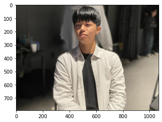
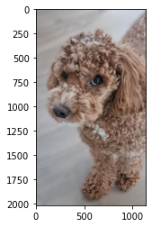
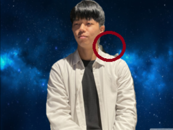
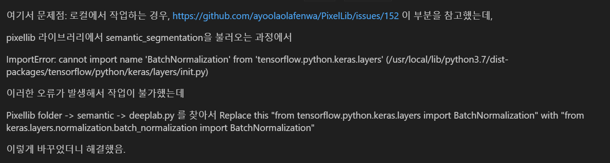
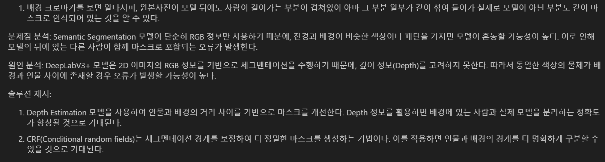
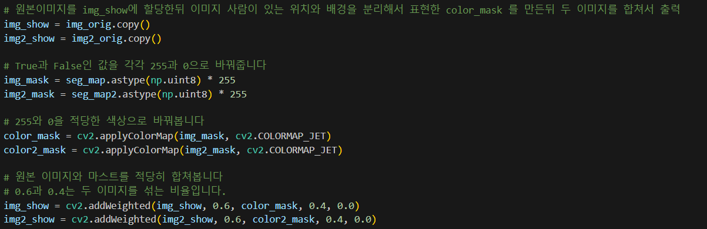

# AIFFEL Campus Online Code Peer Review Templete
- 코더 : 염철헌
- 리뷰어 : 손병진

# PRT(Peer Review Template)
- [x]  **1. 주어진 문제를 해결하는 완성된 코드가 제출되었나요?**
    1. 인물모드 사진을 성공적으로 제작하였다.
        - 인물과 동물 사진을 활용하여 성공적으로 segmentation을 수행하고 배경 수정도 진행함.

        
        

    2. 제작한 인물모드 사진들에서 나타나는 문제점을 정확히 지적하였다.
        - 인물이 입고있는 옷색상과 유사한 색상에 뒤에 나타나서 segmentation이 정밀하게 되지못한 부분을 체크.

        

    3.  인물모드 사진의 문제점을 개선할 수 있는 솔루션을 적절히 제시하였다.
        - Depth 정보를 가지고 있는 Depth Estimation 모델을 활용하여 성능을 보완한다거나 CRF를 활용하여 경계를 보정하는 방식 등 다양한 해결방법을 고민하고 제시함.
    
- [x]  **2. 전체 코드에서 가장 핵심적이거나 가장 복잡하고 이해하기 어려운 부분에 작성된 주석 또는 doc string을 보고 해당 코드가 잘 이해되었나요?**
        - 배경 크로마키 변경 작업 시 배경을 치환하는 과정이나 코드가 적절하게 설명되어 있고 코드도 간결함.
        
- [x]  **3. 에러가 난 부분을 디버깅하여 문제를 해결한 기록을 남겼거나새로운 시도 또는 추가 실험을 수행해봤나요?**
        - 로컬에서 작업 시 발생하는 오류에 대하여 해당 문제를 해결해가는 과정을 기록함.

    
        
- [x]  **4. 회고를 잘 작성했나요?**
        - 프로젝트의 목표에 대한 생각을 잘 기록해두었음.

    
        
- [x]  **5. 코드가 간결하고 효율적인가요?**
        - 코드가 간결하고 주석을 통해 가독성이 높임

    

# 회고(참고 링크 및 코드 개선)

짧은 시간에도 프로젝트 목표를 수행하였고, Depth Estimation 모델이나 CRF(Conditional random fields) 등의 방식을 고려해볼만한것 같다.
많은 분들이 로컬에서 작업 시 문제를 겪었는데 이를 해결하고 리뷰를 남겨놓은 부분도 인상깊다.

