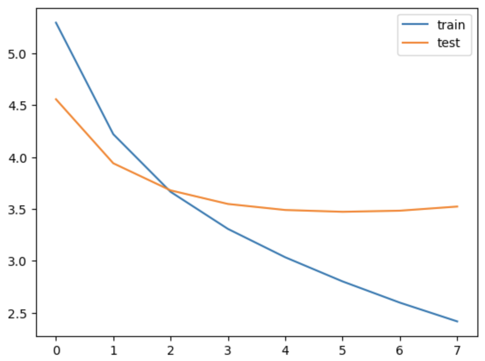
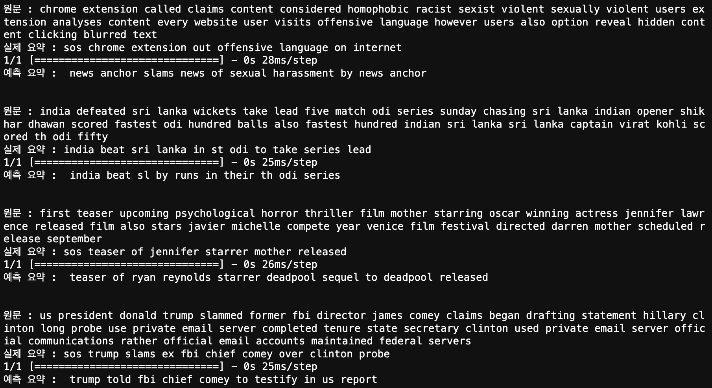
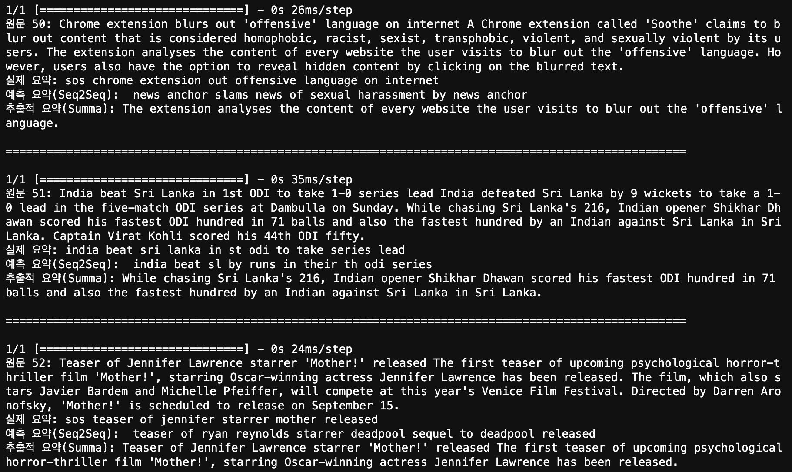
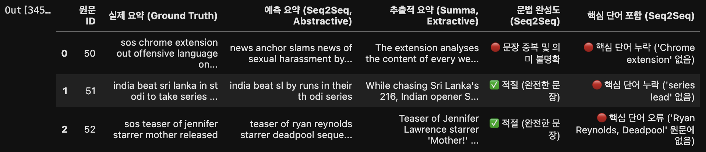
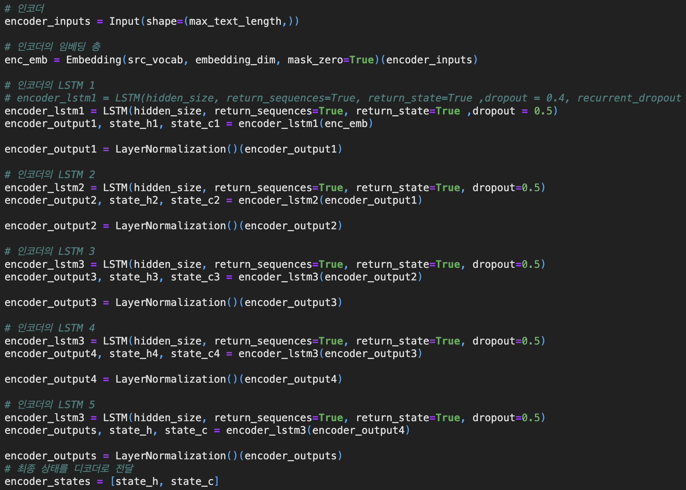
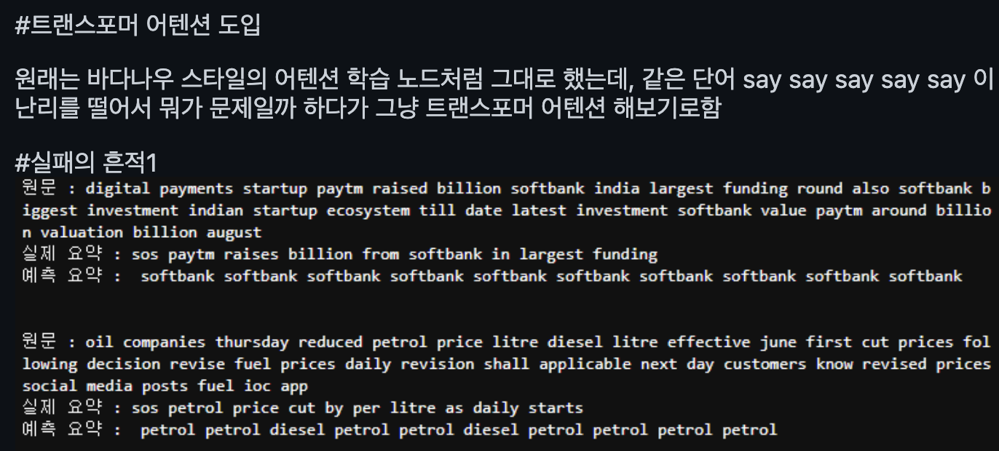
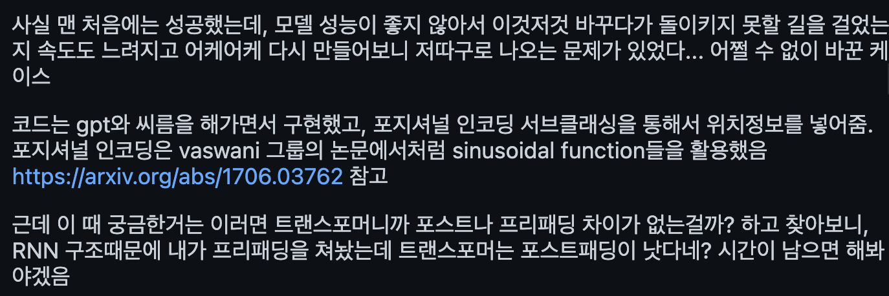
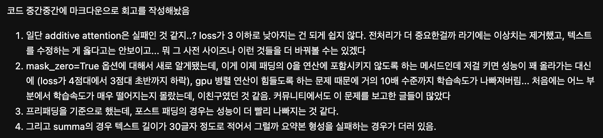
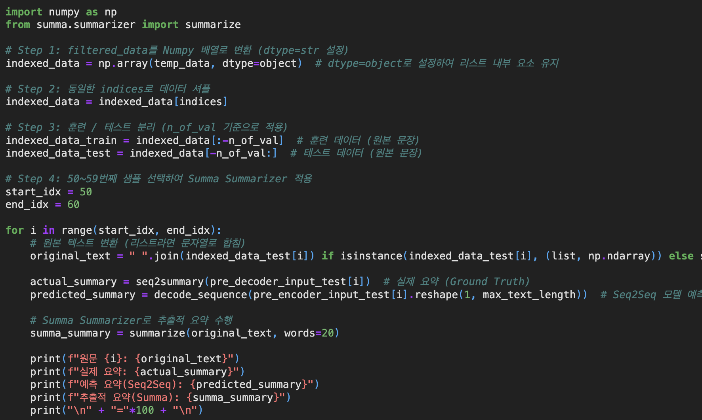

# AIFFEL Campus Online Code Peer Review Templete
- 코더 : 염철헌
- 리뷰어 : 홍예린


# PRT(Peer Review Template)
- [X]  **1. 주어진 문제를 해결하는 완성된 코드가 제출되었나요?**
    - 학습 그래프가 수렴
    
    - Abstractive, extractive 두 가지 모두 수행하여 결과를 도출
    
    
    - 테이블로 비교
    
    
- [X]  **2. 전체 코드에서 가장 핵심적이거나 가장 복잡하고 이해하기 어려운 부분에 작성된 
주석 또는 doc string을 보고 해당 코드가 잘 이해되었나요?**
    - 인코더의 LSTM 층을 5개로 구성하여 성능 개선
    
        - 주석으로 각 layer를 알아보기 쉽게 설명
        
- [X]  **3. 에러가 난 부분을 디버깅하여 문제를 해결한 기록을 남겼거나
새로운 시도 또는 추가 실험을 수행해봤나요?**
    - 성능이 기대치만큼 나오지 않은 것에 대하여 분석하고 다른 실험을 시도
    
    
        
- [X]  **4. 회고를 잘 작성했나요?**
    - 중간 중간 문제에 대하여 분석하고 해결 방법을 기록
    - 이론과 다른 실험 내용을 분석하여 근거를 도출
    
        
- [X]  **5. 코드가 간결하고 효율적인가요?**
    - 코드가 간결하고 알아보기 쉬움
    - 네이밍이 쉬워서 각 변수를 알아보기 쉬움
    


# 회고(참고 링크 및 코드 개선)
```
- mask_zero=True 옵션에 대해 새로 알게 된 부분을 공유해주어 함께 배울 수 있었음!
- 성능 개선을 위해 여러 부분에서 고민하신 흔적이 많이 보임!
- 비슷한 부분에서 의문점을 느낀 부분들이 많아 공감되었음!
```
