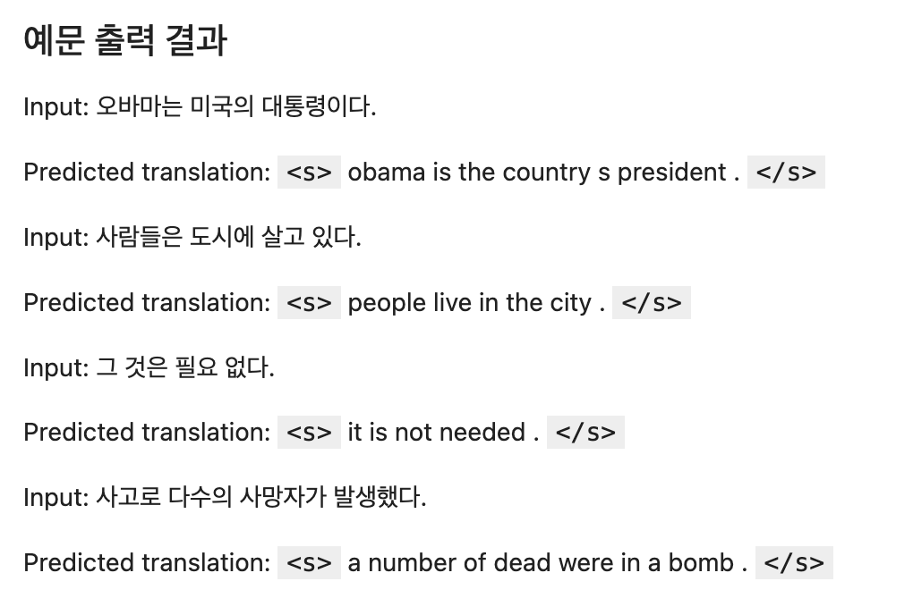
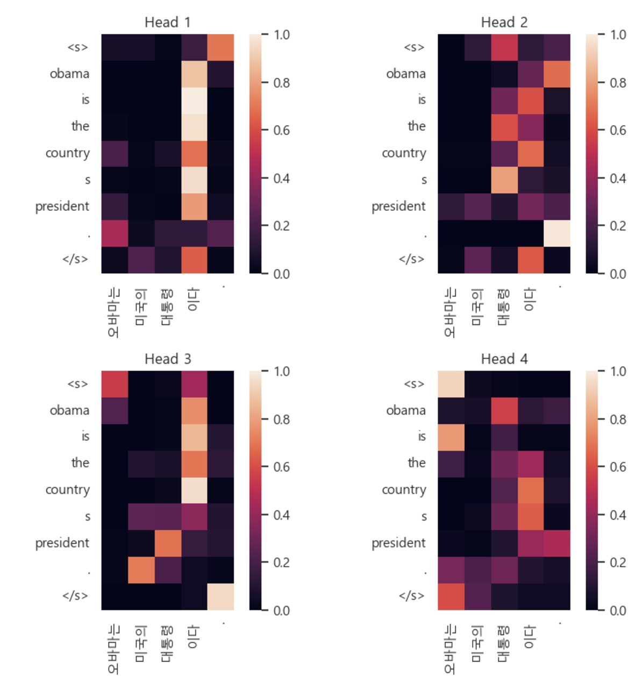
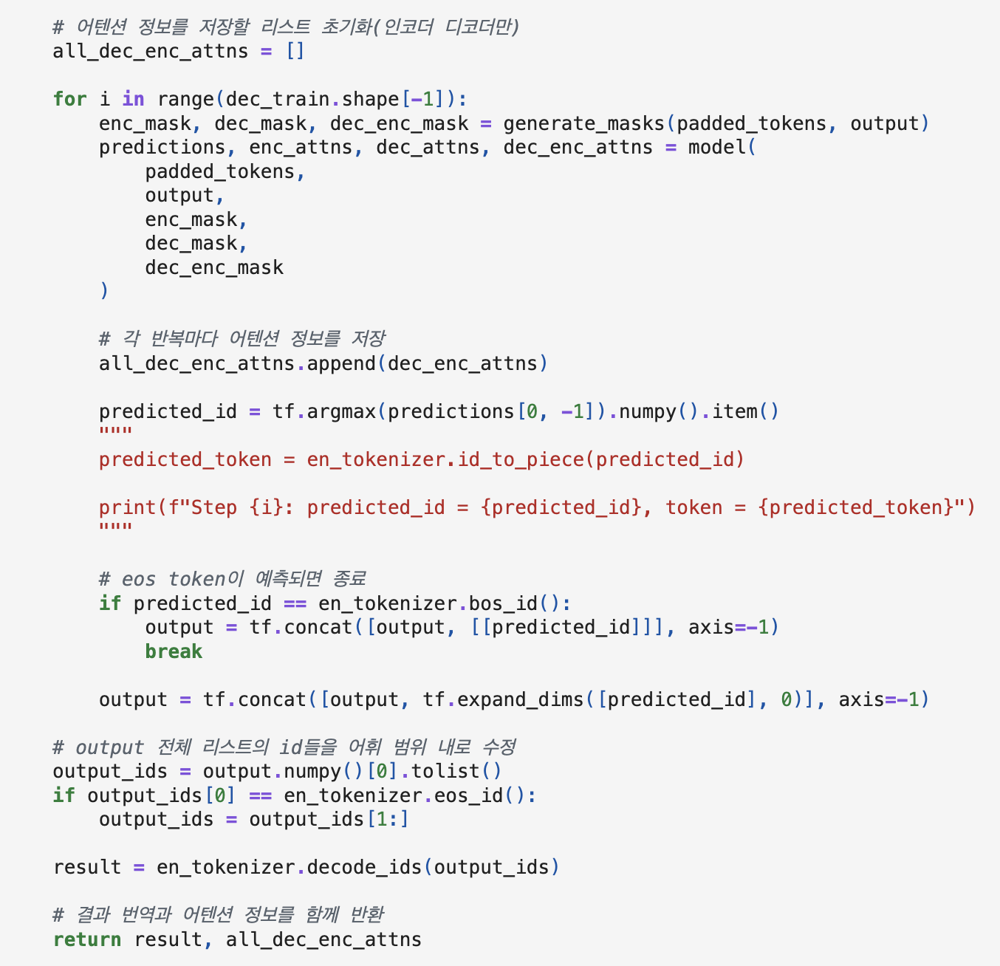
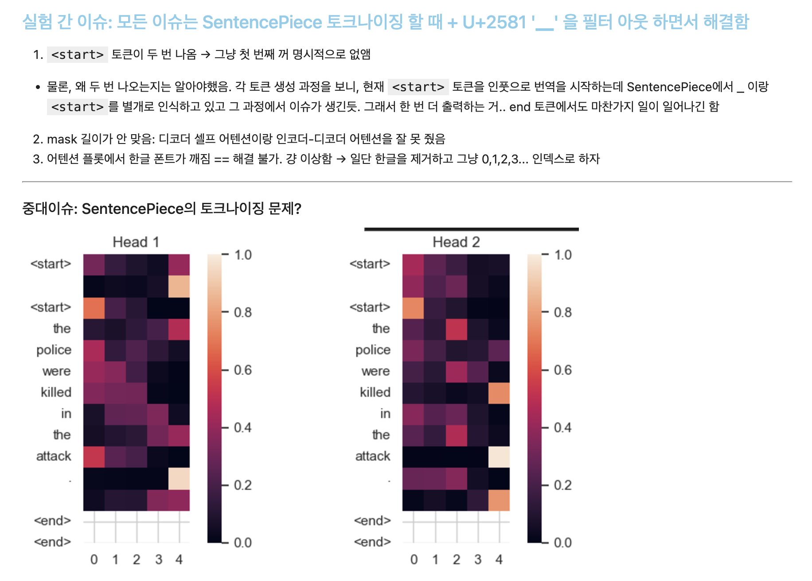
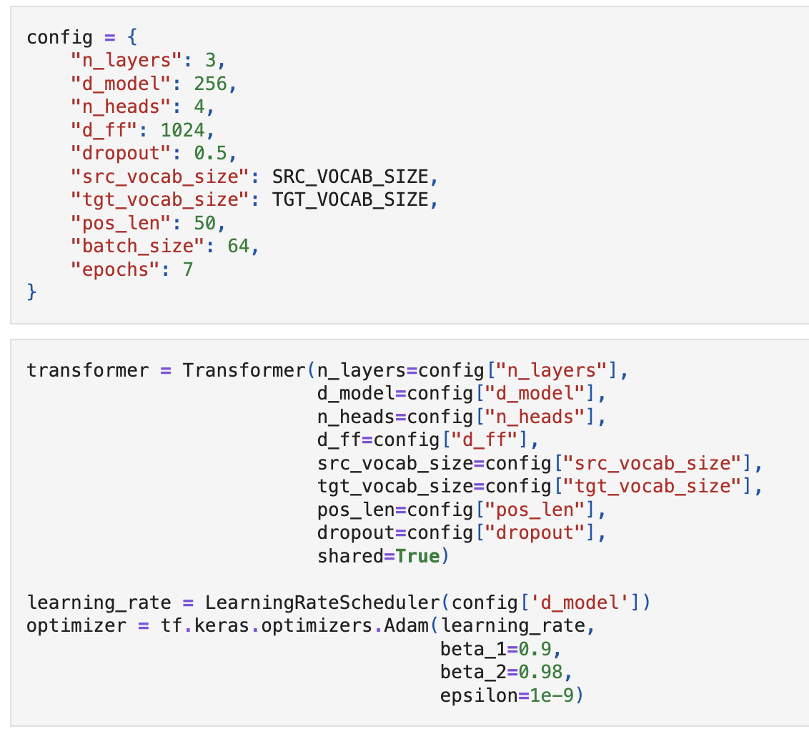

# AIFFEL Campus Online Code Peer Review Templete
- 코더 : 염철헌
- 리뷰어 : 염철헌, 휴가로 인한 셀프 리뷰


# PRT(Peer Review Template)
- [X]  **1. 주어진 문제를 해결하는 완성된 코드가 제출되었나요?**
    - 문제에서 요구하는 최종 결과물이 첨부되었는지 확인
        - 중요! 해당 조건을 만족하는 부분을 캡쳐해 근거로 첨부
        - 노드에서 주어진 예시문의 바리에이션을 테스트해서 일반화 및 번역 태스크를 성공적으로 수행 및 출력하였음.
        - 또한, 인코더-디코더 어텐션을 시각화하여 각 어텐션 헤드가 어떤 토큰들의 유사성을 평가하고 있는지 확인하였음
        - 
        - 
    
- [X]  **2. 전체 코드에서 가장 핵심적이거나 가장 복잡하고 이해하기 어려운 부분에 작성된 
주석 또는 doc string을 보고 해당 코드가 잘 이해되었나요?**
    - 해당 코드 블럭을 왜 핵심적이라고 생각하는지 확인
    - 해당 코드 블럭에 doc string/annotation이 달려 있는지 확인
    - 해당 코드의 기능, 존재 이유, 작동 원리 등을 기술했는지 확인
    - 주석을 보고 코드 이해가 잘 되었는지 확인
        - 중요! 잘 작성되었다고 생각되는 부분을 캡쳐해 근거로 첨부
        - "코드 1차" 부분을 참조하였을 떼, 각 클래싱을 구현할 때마다 마크다운으로 적절한 설명을 첨부하였고 evaluate 함수 부분처럼 노드에서 제공한 코드를 수정한 경우 수정한 부분을 짧게나마 표시하였음.
        - 
        
- [X]  **3. 에러가 난 부분을 디버깅하여 문제를 해결한 기록을 남겼거나
새로운 시도 또는 추가 실험을 수행해봤나요?**
    - 문제 원인 및 해결 과정을 잘 기록하였는지 확인
    - 프로젝트 평가 기준에 더해 추가적으로 수행한 나만의 시도, 
    실험이 기록되어 있는지 확인
        - 중요! 잘 작성되었다고 생각되는 부분을 캡쳐해 근거로 첨부
        - 실험 간 굉장히 다양한 종류로(마스킹 행렬 크기 이슈로 추론 실행 불가, 어텐션 시각화 불가, SentencePiece 토크나이저의 U+2581 토큰 문제 등) 에러를 겪었으며, 그 때마다 기록을 남겨놓음으로써 "코드 2차"에서 오류 없이 깔끔하게 원하는 모델 훈련 및 성능 평가와 시각화까지 성공하였음.
        - 
        
- [X]  **4. 회고를 잘 작성했나요?**
    - 주어진 문제를 해결하는 완성된 코드 내지 프로젝트 결과물에 대해
    배운점과 아쉬운점, 느낀점 등이 기록되어 있는지 확인
    - 전체 코드 실행 플로우를 그래프로 그려서 이해를 돕고 있는지 확인
        - 중요! 잘 작성되었다고 생각되는 부분을 캡쳐해 근거로 첨부
        - "코드 1차"를 구현하면서 각 시행에서 예문을 번역한 결과를 출력하고 학습 곡선을 플롯하였으며, 최종 결과는 노트북 최상단에 기록하여 가시성을 확보하고자 했음.
        - 또한, 노트북 최상단에 프로젝트를 진행하며 겪은 문제를 기록하고 최종적으로 해결한 방법에 대해 기록하였음
        - 
        
- [X]  **5. 코드가 간결하고 효율적인가요?**
    - 파이썬 스타일 가이드 (PEP8) 를 준수하였는지 확인
    - 코드 중복을 최소화하고 범용적으로 사용할 수 있도록 함수화/모듈화했는지 확인
        - 중요! 잘 작성되었다고 생각되는 부분을 캡쳐해 근거로 첨부
        - 클래싱과 적절한 함수 정의를 통해서 최대한 간략화 함. 특히, 하이퍼파라미터를 컨피그로 한 곳에 묶어 코드 가독성을 확보하고자 하였음
        - 
        

# 회고(참고 링크 및 코드 개선)
```
# 리뷰어의 회고를 작성합니다.
# 프로젝트를 진행하며 노드 코드를 꼼꼼히 분석하며 오류를 지적해낸 것은 스스로 뿌듯하고, 그 외에도 자체적으로 겪은 문제들이 너무 많아 해결하지 못할 듯 보였으나 기록을 통해서 각각의 원인을 규명하고자 노력했고 최종적으로 오류가 없는 코드를 완성해 결실을 맺은 것 같아 뿌듯합니다.
# 이번 기회로 SentencePiece 토크나이징에 대해서도 꽤나 잘 알 수 있었고, 어떤 식으로 디버깅을 진행해야 하는지, 기록이 왜 필요한지도 잘 알 수 있었습니다.
```
